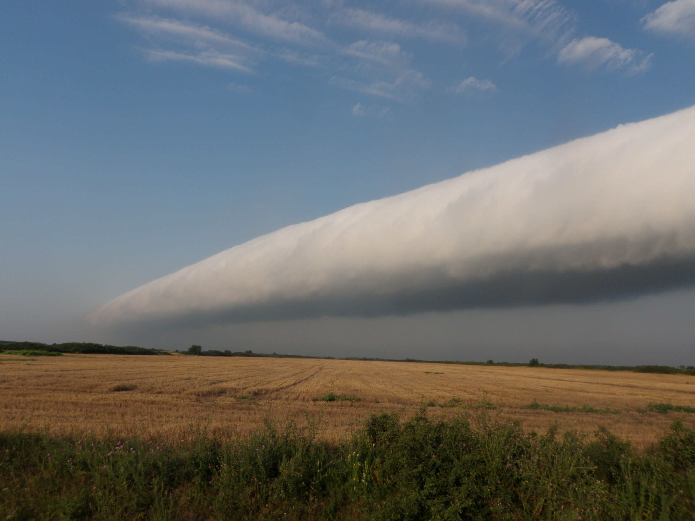

# Dryline
A [dry line](https://en.wikipedia.org/wiki/Dry_line) is a line across a continent that separates moist air from dry air. Storms (cloud formations) form along a dry line.



## Purpose
Dryline is a Clojure library that programmatically builds specs for CloudFormation resource types. In the UNIX tooling mindset, Dryline does not build or deploy CloudFormation templates.

## Usage

Add the dependency into your `deps.edn`.

```clojure
;; stable version of dryline
{roomkey.dryline {:git/url "git@github.com:roomkey/dryline.git"
                  :sha "<SHA>"}}
```

### Parse and validate a CloudFormation Specification file
AWS regularly publishes specification files for CloudFormation. They are available for download [here](https://docs.aws.amazon.com/AWSCloudFormation/latest/UserGuide/cfn-resource-specification.html) either as a single JSON file for all CloudFormation resources or as a ZIP archive of each service individually.

The [`roomkey.dryline.parse`](src/roomkey/dryline/parse.clj) namespace ensures that the specification file is parsed to a format that the rest of Dryline can process.

We encountered a few issues of the specification files published by AWS being incorrectly formatted and therefore recommend that you validate their structure before relying on their contents. AWS were responsive and fixed the issues we found. If you encounter an invalid specification file we recommend raising an issue with AWS.

We translated the [expected format of specification files](https://docs.aws.amazon.com/AWSCloudFormation/latest/UserGuide/cfn-resource-specification-format.html) into Clojure specs in the [`roomkey.dryline.validation`](src/roomkey/dryline/validation.clj) namespace

```clojure
(require '[roomkey.dryline.parse :as parse]
         '[roomkey.dryline.validation]
         '[clojure.java.io :as io]
         '[clojure.spec.alpha :as s])
         
(def parsed-spec (parse/parse (io/reader "path/to/Specification.json")))

(s/valid? :roomkey.aws.cloudformation/Specification parsed-spec)
;; If this returns false, then there is an issue with the specification file
```

### Generate and use specs from a CloudFormation Specification file
In this example we will generate and use specs for an S3 Bucket. A version of the specification file can be found [here](test_resources/aws/S3BucketSpecification.json). 

```clojure
(require '[roomkey.dryline.parse :as parse]
         '[roomkey.dryline.specs :as specs]
         '[clojure.java.io :as io]
         '[clojure.spec.alpha :as s])
         
(def parsed-spec (parse/parse (io/reader "path/to/S3BucketSpecification.json")))

(specs/gen-specs parsed-spec specs/primitive-type->predicate)

(s/describe :roomkey.aws.s3/Bucket)
;; This should return something of the form (keys :opt-un [...])

(s/valid? :roomkey.aws.s3/Bucket {})
;; This is true, becuase all properties for an S3 bucket are optional

(s/valid? :roomkey.aws.s3/Bucket {:BucketName 123})
;; This is false, because :BucketName must be a string
```

### Crucible Integration
A detailed example of integrating Crucible and Dryline can be found [here](docs/crucible.md)

## Vocabulary
CloudFormation specification files are complex. Here is a list of terms found throughout AWS documentation and the Dryline codebase

* **AWS Type Identifier**: An identifier found in AWS specifications of the form \<ServiceProvider\>::\<ServiceName\>::\<DataTypeName\>. Dryline parses these identifiers as strings.
* **Service Provider**: The first value in a type identifier. Either AWS or Alexa.
* **Service Name**: The name of the AWS service to which a resource or property belongs. E.g. S3, Lambda, EC2, ApiGateway.
* **Data Type Name**: The name of the resource or property type. DataTypeName references a property type if it of the form \<ResourceTypeName\>.\<PropertyTypeName\>.
* **Resource Type**: A top level CloudFormation type. Resource types are a tuple of [type-identifier, type-specification].
* **Property Type**: A sub-type of a resource type used to describe data structures that are not primitive. Resource types are a tuple of [type-identifier, type-specification].
* **Type Specification**: A map describing a resource type or property type. Contains the key Properties.
* **Properties**: A map of property-identifier -> property-specification.
* **Property Identifier**: An identifier for a property of a resource type or property type. Dryline parses these identifiers as keywords.
* **Property Specification**: A map describing a property. Provides information about the type of the property and whether or not it is required.
* **Primitive Type Mapping**: A function that maps an AWS primitive type to a Clojure spec.

## Background
Roomkey wanted to find a solution for building and validating CloudFormation templates programmatically with Clojure. We liked and supported the work done in the [Crucible](https://www.github.com/brabster/crucible) library but found that developers spent a lot of time writing and updating Clojure specs for CloudFormation resources, waiting on a release cycle and updating project dependencies. 

We then discovered that AWS publishes specification files that describe the shape of all CloudFormation resources. We developed the Dryline library to generate Clojure specs automatically from these files to ensure complete coverage of all resources in CloudFormation and reduce the amount of human time spent maintaining Clojure specs. 

One might wonder why we invested so much time into validating CloudFormation templates ourselves -- there is bound to be an official AWS tool that does that, right? Unfortunately the answer is not a simple yes. On the client side, AWS cli tooling can validate that a CloudFormation template is valid JSON which we found to be of little use. Only once the template has been deployed to CloudFormation can it be validated for its structure. We believe the validation of CloudFormation templates happens in two steps for each resource. First, all of the resources are validated for having the correct structure: required keys are present and data types are correct. This validation happens early in the CloudFormation deployment and thus clients are notified quickly of an error. Second, a request for each resource being updated, created, or deleted is sent to a specific AWS service. If the request contains invalid data then the services responds with an error to CloudFormation which reports the error back to the client. If a CloudFormation template is making a large change-set, these service level validations can happen after a significant amount of time from the deployment. Therefore we desired to perform as much validation on the client side as possible to fail early and reduce the amount of time per iteration.

#### Source materials

<https://d1uauaxba7bl26.cloudfront.net/latest/gzip/CloudFormationResourceSpecification.json>

<https://docs.aws.amazon.com/AWSCloudFormation/latest/UserGuide/cfn-resource-specification-format.html>